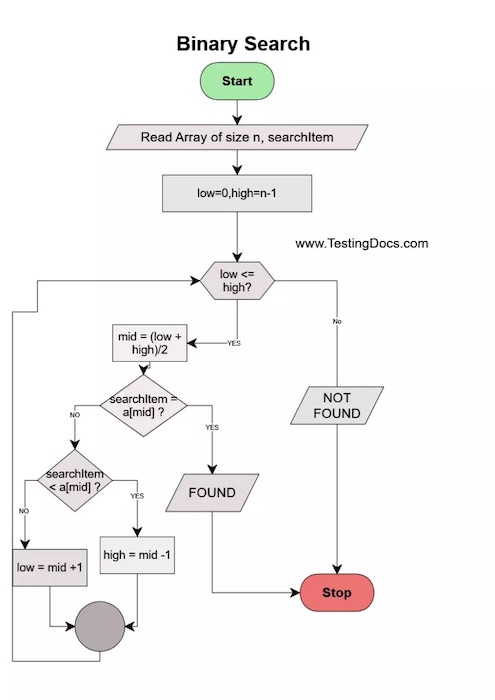

# Binary Search Visualizer

[Link to live app](https://djbartolini.github.io/binary-search-visualizer/)

This is an educational project I put together to help learn how to use Vue.js. This SPA allows users to see the steps involved in the binary search algorithm.

The app features a hard-coded array and key for now - I will be updating this soon to allow user input.

## Binary Search

## Technologies

- [Vue.js](https://vuejs.org/)
- [Vite](https://vitejs.dev/guide/)
- [GitHub Pages](https://pages.github.com/)
