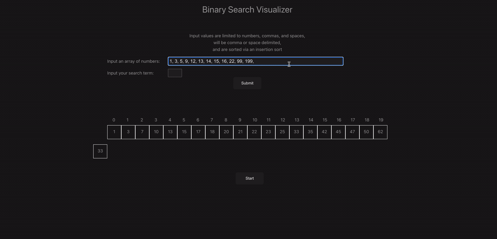

# Binary Search Visualizer

[Link to live app](https://djbartolini.github.io/binary-search-visualizer/)

This is an educational project I put together to help learn how to use Vue.js. This SPA allows users to see the steps involved in the binary search algorithm.

## Usage

Navigate to [this link](https://djbartolini.github.io/binary-search-visualizer/) to access the app. An example array and key have been provided. To use your own parameters, input your array values into the array input field. Input a search key into the 'search term' input. Submit to run the visualizer using these custom parameters.

Hit the "Search" button to initialize the visualizer.

After a search has been done, you can reset the search, or enter new parameter values.

## Demo

## Binary Search

## Technologies

- [Vue.js](https://vuejs.org/)
- [Vite](https://vitejs.dev/guide/)
- [GitHub Pages](https://pages.github.com/)
